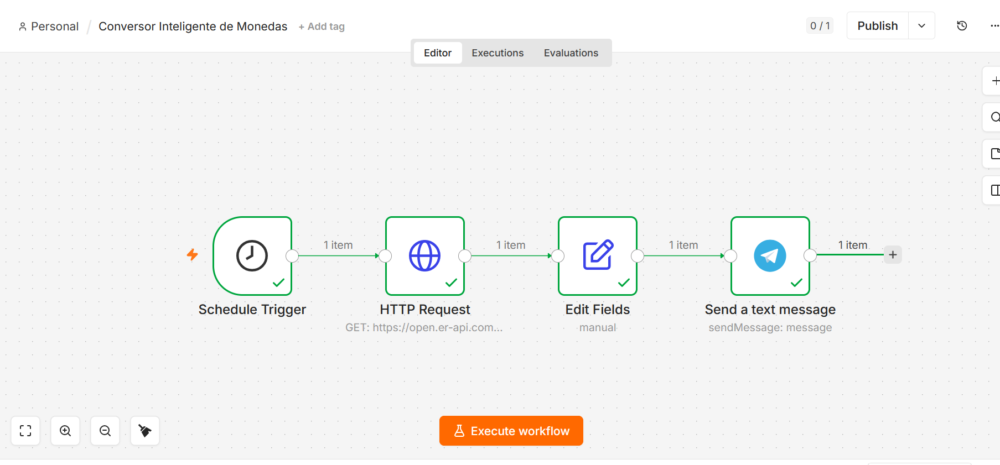
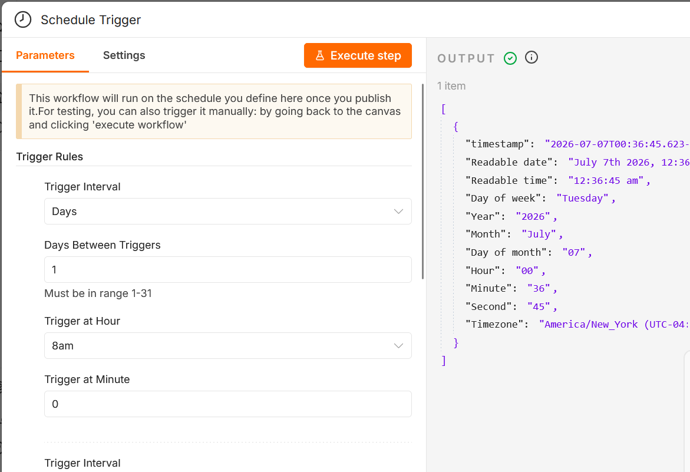
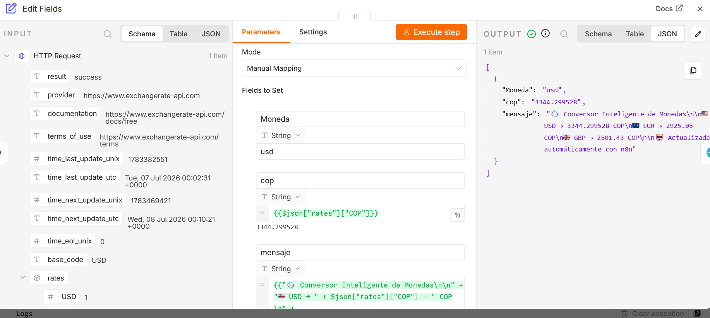
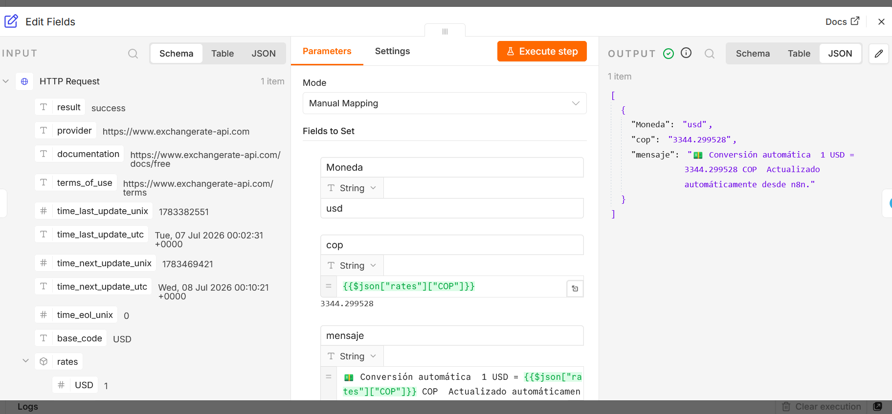
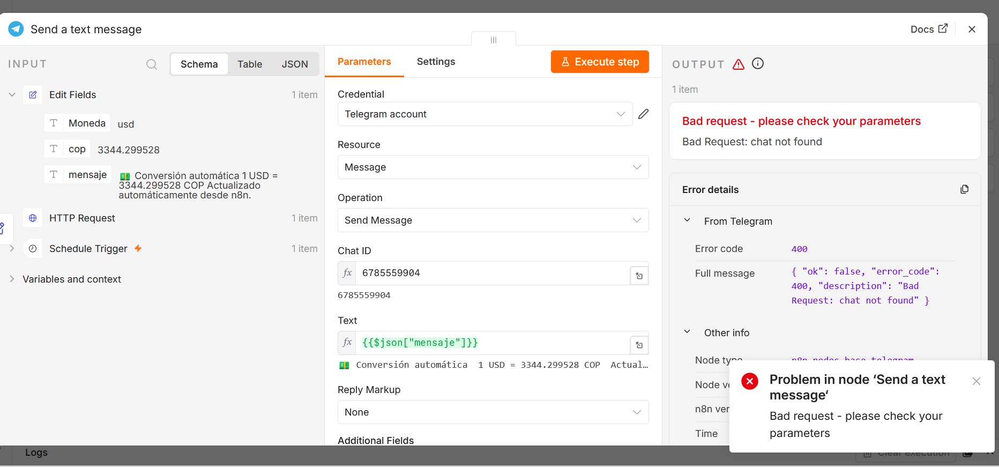
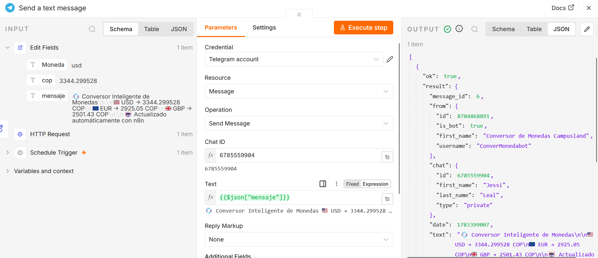
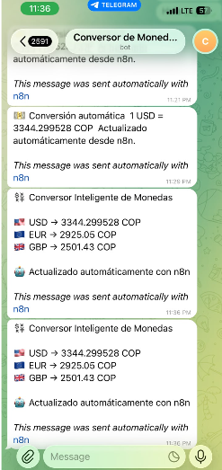

 # Conversor Inteligente de Monedas con n8n
 
 ### Información del proyecto

Proyecto: Automatización con n8n - Conversor Inteligente de Monedas

Integrantes:

### Mariana Colmenarez

### Jessica Urrego

Asignatura: Inteligencia Artificial 1

Herramienta principal: n8n

Integración utilizada: Telegram Bot API

trainer: Kevin Jimenez

  

--- 

## 1. Introducción

Actualmente, consultar el valor de monedas extranjeras requiere ingresar manualmente a diferentes plataformas o páginas web. Este proyecto propone una solución automatizada utilizando n8n, una API pública de tasas de cambio y Telegram.

El sistema consulta automáticamente el valor actualizado de diferentes monedas internacionales y realiza la conversión a pesos colombianos (COP). Posteriormente, envía el resultado mediante un bot de Telegram.

## 2. Objetivo del proyecto

### Objetivo general

Diseñar un workflow en n8n capaz de consultar automáticamente tasas de cambio, procesar la información obtenida desde una API externa y enviar los resultados mediante Telegram.

### Objetivos específicos

Crear un flujo automático utilizando n8n.
Integrar una API pública de conversión de monedas.
Procesar información en formato JSON.
Realizar conversiones de monedas extranjeras a pesos colombianos.
Enviar notificaciones automáticas mediante Telegram.
## 3. Problema planteado

Muchas personas necesitan conocer constantemente el valor actualizado de monedas extranjeras como dólar, euro o libra esterlina. Hacer esta consulta manualmente puede ser repetitivo y consumir tiempo.

Para solucionar este problema se desarrolló una automatización que realiza la consulta de manera programada y entrega la información directamente al usuario.

## 4. Investigación realizada

### ¿Qué es n8n?

n8n es una plataforma de automatización de procesos que permite conectar diferentes aplicaciones y servicios mediante 
workflows.

Un workflow está compuesto por nodos que realizan tareas específicas, como recibir información, consultar APIs, procesar datos o enviar mensajes.

### ¿Qué es una API?

Una API (Application Programming Interface) permite que diferentes aplicaciones puedan comunicarse entre sí.

En este proyecto se utilizó una API de tasas de cambio para obtener información actualizada sobre monedas internacionales.

### ¿Qué es JSON?

JSON es un formato utilizado para almacenar y transportar información entre aplicaciones.

Ejemplo de respuesta recibida:

{
  "base_code": "USD",
  "rates": {
    "COP": 4105.85
  }
}

n8n utiliza estos datos para extraer los valores necesarios.

## 5. Herramientas utilizadas
Herramienta	Uso
n8n	                 Creación del workflow
Exchange Rate API	Consulta de tasas de cambio
Telegram Bot API	Envío automático de mensajes
JSON	             Manejo de datos recibidos
## 6. API utilizada
Exchange Rate API

API utilizada:

https://open.er-api.com/v6/latest/USD

Método utilizado:

GET

Función:

Obtener las tasas de cambio actuales tomando como moneda base el dólar estadounidense (USD).

## 7. Desarrollo del Workflow

El flujo creado en n8n está compuesto por los siguientes nodos:

Schedule Trigger
        |
        ↓
HTTP Request
        |
        ↓
Set
        |
        ↓
Telegram
## 8. Configuración paso a paso

 ### 8.1 Schedule Trigger

Este nodo permite ejecutar automáticamente el workflow.

Configuración:

Tipo: Ejecución programada.
Frecuencia: Diaria.
Hora: 08:00 AM.

Su función es iniciar el proceso automáticamente sin intervención del usuario.

Captura:

  

### 8.2 HTTP Request

Este nodo realiza la conexión con la API externa.

Configuración:

Método:

GET

URL:

https://open.er-api.com/v6/latest/USD

La API devuelve información en formato JSON con las diferentes tasas de cambio.

Captura:
 

  

### 8.3 Procesamiento de información con Set

El nodo Set permite organizar la información recibida y crear el mensaje que será enviado.

Datos utilizados:

Moneda base.
Valor del dólar en COP.
Conversión de otras monedas.

Ejemplo del mensaje generado:

 Conversor Inteligente de Monedas

🇺🇸 USD → 4105 COP
🇪🇺 EUR → 4500 COP
🇬🇧 GBP → 5200 COP

 Actualizado automáticamente con n8n
Captura:

  

### 8.4 Integración con Telegram

Se creó un bot mediante BotFather y se conectó con n8n utilizando el token de acceso.

El nodo Telegram tiene como función enviar automáticamente el mensaje generado por el workflow.

Captura:

  

con telegram no queria funcionar porque el bot creado no habia recibido ningun mensaje

  

## 9. Resultado obtenido

El sistema logró ejecutar correctamente la automatización:

Inicia automáticamente según la programación establecida.
Consulta la API de monedas.
Procesa la información recibida.
Genera un mensaje personalizado.
Envía el resultado a Telegram.
Captura del mensaje recibido:

  

## 10. Mejoras implementadas

Como mejora adicional al reto inicial, se agregó soporte para múltiples monedas:

Dólar estadounidense (USD).
Euro (EUR).
Libra esterlina (GBP).

Esto permite que el usuario reciba más información en un solo mensaje.

  

## 11. Resultados obtenidos

Se obtuvo un sistema funcional capaz de automatizar la consulta de tasas de cambio y enviar información actualizada sin necesidad de realizar consultas manuales.

El proyecto demuestra la integración entre:

Automatización de procesos.
APIs externas.
Procesamiento de datos JSON.
Servicios de mensajería.
## 12. Conclusiones

La realización de este proyecto permitió comprender el funcionamiento de los workflows en n8n y la importancia de la automatización para reducir tareas repetitivas.

Además, se aprendió a integrar servicios externos mediante APIs, utilizar herramientas como Telegram para entregar información automáticamente y la creacion del bot.

  

El resultado final fue una solución funcional, escalable y con posibilidad de agregar nuevas monedas o funcionalidades en el futuro.

